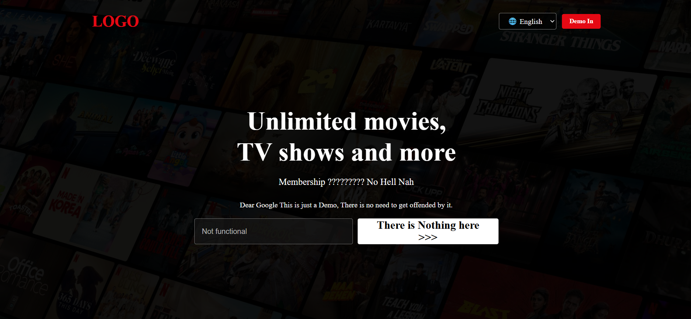

Netflix Clone 🎬

A responsive Netflix homepage clone built with HTML and CSS, featuring a modern layout, navigation bar, movie sections, and a clean streaming-platform UI.

✨ Features
- Frontend Portfolio / Demo Project
- Responsive homepage
- Hero/banner section
- Movie and content sections
- Clean and modern UI
- Built using pure HTML and CSS

🖼️ Preview

 

🛠️ Technologies Used

- HTML5
- CSS3

🚀 How to Run

1. Clone or download this repository.
2. Open the project folder.
3. Open "index.html" in your browser.

📌 Project Status

Completed frontend clone project.

---

Built with HTML & CSS 💻
